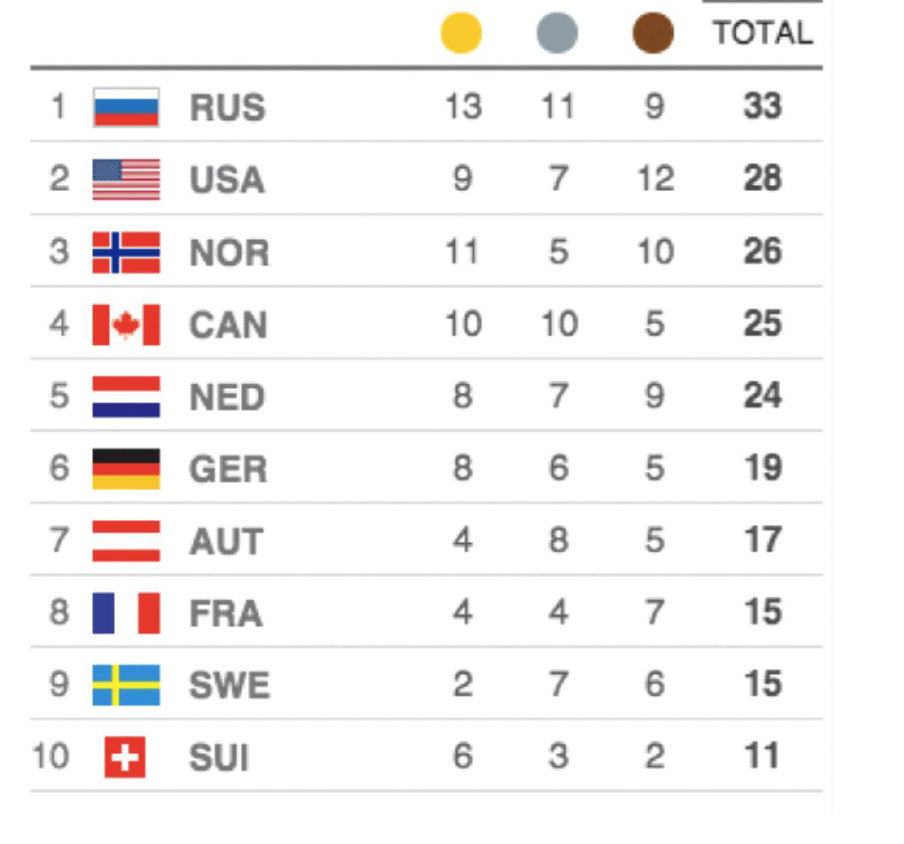

# medal-count-app
The mini app is meant to display medal results during the Olympic games. The app shows up to 10 countries that have won the most medals of a given kind in the Olympics games.


This project is built with Next.js.

## Getting Started
 
### Prerequisites
 
Make sure you have the following installed on your machine:
 
- [Node.js](https://nodejs.org/)
- [npm](https://www.npmjs.com/) 
 
### Installation
 
1. Clone the repository from main branch:
 ```bash
 git clone https://github.com/sanjeevbaurai02/medal-count-app.git

2.  Change into the project directory:
cd medal-count-app

3. Install dependencies:
npm install

4. Run the development server:
npm run dev

Visit http://localhost:3000 in your browser to see the app.
 
5. To build the app for production:
npm run build
